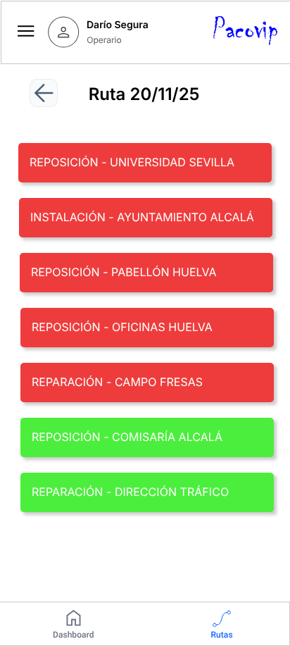
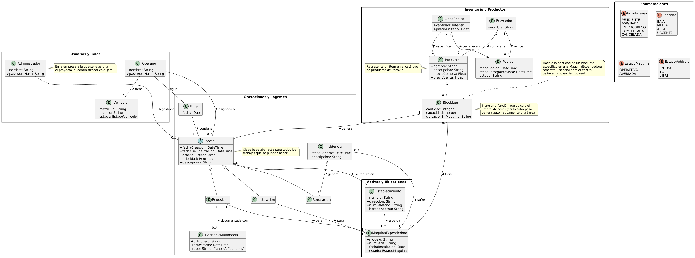

# 🚚 Pacovip - Sistema de Gestión de Vending y Logística

## 📋 Descripción
**Pacovip** es una solución integral de software diseñada para optimizar la operativa de empresas de máquinas vending. El sistema centraliza la gestión de **logística, mantenimiento y reposición de stock**, permitiendo una coordinación eficiente entre los administradores de flota y los operarios de campo.

Este repositorio contiene la **ingeniería del proyecto**, incluyendo el análisis de requisitos, diseño de arquitectura, diagramas UML y prototipos de interfaz.

## 🚀 Módulos Principales

### 1. 🏭 Gestión de Activos
* **Máquinas:** Control de ubicación, estado y stock de cada máquina expendedora.
* **Vehículos:** Gestión de flota y asignación de vehículos a rutas.
* **Productos:** Catálogo centralizado y control de inventario.

### 2. 🗺️ Logística y Rutas
* **Planificación de Rutas:** Creación y optimización de rutas de reparto diario.
* **Asignación de Tareas:** Distribución de órdenes de reposición a los operarios.

### 3. 🛠️ Mantenimiento e Incidencias
* **Reporte de Averías:** Sistema para registrar incidencias en tiempo real.
* **Flujo de Reparación:** Seguimiento del estado de las averías (Pendiente -> En reparación -> Resuelto).

### 4. 👥 Gestión de Usuarios (Roles)
* **Administrador:** Acceso total al panel de control, gestión de usuarios y analíticas.
* **Operario:** Interfaz móvil simplificada para consultar rutas, ejecutar tareas de reposición y reportar averías.

## 🛠️ Diseño y Arquitectura
El proyecto ha seguido una metodología rigurosa de Ingeniería del Software:
* **Modelado de Requisitos:** Definición formal de casos de uso (ver carpeta `/assets`).
* **Diagramas UML:**
    * Diagramas de Clases (Estructura de datos).
    * Diagramas de Secuencia (Interacción entre objetos).
    * Diagramas de Estado (Ciclo de vida de las averías y pedidos).
* **Prototipado UI:** Diseño de interfaces para Web (Admin) y Móvil (Operario).

## 📸 Galería del Proyecto

| Panel de Administración | App Operario |
|:---:|:---:|
|  |  |

| Gestión de Rutas | Diagrama de Clases |
|:---:|:---:|
|  |  |

---
*Proyecto Universitario de Ingeniería de Software - 2026*
